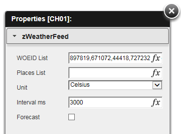

QlikView Extensions zWeather Feed
=================================

This extension implements zWeatherFeed Yahoo! Weather Feed Plugin for jQuery: http://www.zazar.net/developers/jquery/zweatherfeed/

Properties:
-----------

1. WOEID List : a list of WOEIDs (Where On Earth IDentifier) to call weather API http://en.wikipedia.org/wiki/GeoPlanet
2. Places List: a list of places (eg. Barcelona,Istanbul) if you don't have WOEIDs,
                it will query Yahoo API to obtain WOEIDs and store it in the field above
3. Unit       : unit for temperature (Celsius/Fahrenheit)
4. Interval ms: interval for scrolling multiple places in milliseconds
5. Forecast   : shows weather forecast for first WOEID (press F5 for rerender)